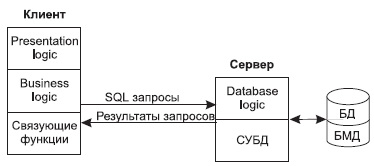
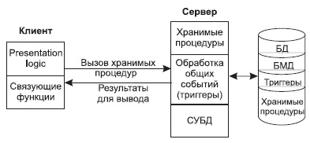
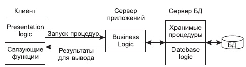

# Ответы на экз вопросы

---

## Оглавление 

1. [Назначение и элементы автоматизированных информационных систем.](#1st)

2. [Развитие архитектуры и технологий автоматизированных информационных систем.](#2nd)

3. [Базы данных, системы баз данных (СБД). Элементы СБД.](#3rd)

4. [Понятие и функции систем управления базами данных (СУБД), основные модули СУБД.](#4th)

5. [Архитектура систем баз данных.](#5th)

6. [Этапы проектирования автоматизированных информационных систем.](#6th)

7. [Модель «сущность-связь». Элементы модели.](#7th)

8. [Модель «сущность-связь». Порядок построения. Нотации диаграмм.](#8th)

9. [Модель «сущность-связь». Особые и нестандартные схемы. Расширения модели.](#9th)

10. [Объединение моделей локальных представлений при проектировании базы данных.](#10th)

11. [Понятие модели данных. Ранние модели данных.](#11th)

12. [Понятие модели данных. Реляционная модель данных.](#12th)

13. [Правила преобразования модели «сущность-связь» в реляционную модель данных.](#13th)

14. [Операции реляционной алгебры.](#14th)

15. [Правила построения формул реляционного исчисления с переменными-кортежами.](#15th)

16. [Формулы реляционного исчисления для основных операций.](#16th)

17. [Нормализация реляционных отношений.](#17th)

18. [Законы алгебраических преобразований реляционных выражений.](#18th)

19. [Алгоритм Ульмана оптимизации реляционных выражений (с примером).](#19th)

20. [Язык запросов SQL. Компоненты языка. SELECT-запросы для операций ре-ляционной алгебры.](#20th)

21. [Язык запросов SQL. Внешнее и внутреннее соединение в запросах выборки. Вложенные запросы и подзапросы.](#21st)

22. [Язык запросов SQL. Агрегирующие функции. Группирующие SELECT-запросы. Формирование сводных отчетов.](#22nd)

23. [Язык запросов SQL. Запросы модификации данных.](#23rd)

24. [Транзакции в базах данных.](#24th)

25. [Принципы хранения данных в БД. Иерархия устройств памяти. Повышение эффективности системы баз данных за счет аппаратных средств.](#25th)

26. [Организация данных в БД. Представление и хранение элементов данных. Последовательная индексация.](#26th)

27. [Способы доступа к данным: вторичные индексы, В-деревья, хэш-таблицы.](#27th)

28. [Основные понятия и развитие моделей вычислений. Модели централизован-ного управления, автономных персональных вычислений, файл-сервер.](#28th)

29. [Технология клиент-сервер. Модель доступа к удаленным данным.](#29th)

30. [Технология клиент-сервер. Модель сервера базы данных.](#30th)

31. [Технология клиент-сервер. Модель сервера приложений. Модель тонкого клиента.](#31st)

---


## 1. <a name="1st"></a> Назначение и элементы автоматизированных информационных систем.
    Информация — сведения о лицах, предметах, фактах, событиях , являниях и процессах независимо от формы и представления.

Для сбора, хранения и эффективного использования информации применяются информационные системы функционирующие в различных предметных областях. 

    АИС (автоматизированные информационные системы) - хранится и обрабатывается в компьютерной системе.

<!---->

    Предметная область — часть реального мира рассматриваемая в пределах данного контекста / данной задачи. 

<!---->

    В АИС предметная область — часть реального мира которая подлежит изучению с целью организации управления и автоматизации. 

Развитие АИС началось с файловых систем хранения данных. Такие системы включали набор прикладных программ выполняющих для пользователя определенные операции. Например: 
* интерфейс ввода данных
* формирование отчетов

Каждая программа хранила собственные данные и управляла ими, формат физического хранения данных определялся программой. Такой схеме присущи следующие ограничения:
* Разделение и изоляция данных. Данные из различных файлов сложно объединять

* Дублирование данных. Часть данных используемых другими программами дублируется.

* Зависимость программ от данных.

* Несовместимость форматов файлов. 

* Ориентация на фиксированые запросы. 

* Большое колличество прикладных программ и типов файлов которые нужно обслуживать.

* Сложно организовать совместную работу с данными.

---

## 2. <a name="2nd"></a> Развитие архитектуры и технологий автоматизированных информационных систем.

### TODO 

---

## 3. <a name="3rd"></a> Базы данных, системы баз данных (СБД). Элементы СБД.

    БД — совместно используемый набор логически связаных данных вместе с
    описанием этих данных предназначеных для решения определнных задач в 
    предметной области. 

Важные свойства:
* Независимость программ от данных за счет наличия описания данных и определения способа физического размещения данных в самой БД. 

* Разделение данных. Возможность использования несколькими пользователями отдельных элементов хранимых в БД. (Одновременная работа с одними и теме же данными и различными сегментами БД)

* Интегрируемость данных. Возможность объединения различных элементов данных хранимых в БД для получения требуемой информации.

<!---->

    СБД - АИС спроектированные по концепции БД.

СБД включает в себя следующие компоненты:
* Аппаратное обеспечение:
    * Вычислительные ресурсы
    * Средства хранения
    * Коммуникационные средства
* Программное обеспечение:
    * Операционные системы
    * Сетевое ПО
    * СУБД
* Данные, в том числе метаданные
* Пользователь:
    * Администраторы данных и баз данных
    * Разработчики баз данных
    * Прикладные программисты
    * Конечные пользователи
* Документация

---

## 4. <a name="4th"></a> Понятие и функции систем управления базами данных (СУБД), основные модули СУБД.

    СУБД - системное ПО  с помощью которого пользователи (администраторы) могут определять, создавать и поддерживать БД а также осуществлять к ней контролируемый доступ. 

<!---->

Основные функции СУБД:
* Управление данными во внешней памяти

* Управление данными в оперативной памяти

* Ведение журналов транзакций, резервное копирование и восстановление данных

* Поддерржка языков запросов к БД

* Обеспечение целостности данных 

* Поддержка парралельной работы пользователей

* Обеспечение санкционированного доступа к 
данным

### TODO(основные модули?)

---

## 5. <a name="5th"></a> Архитектура систем баз данных.

---

    Основная цель СУБД — предложить пользователю абстрактное представление данных скрыв детали хранения и управления ими. 
    
<!---->   

Для решения этой задачи большинство современных СУБД основываются на архитектуре предложеной ANSI SPARC. В этой архитектуре определено 3 уровня абстракции (три уровня описания данных):
* Внешний 
    * Внешние представления отображают потребности отдельных категорий пользователей и содержат те объекты предметной области, которые нужны данному пользователью. 
* Концептуальный 
    * На концептуальном уровне имеется обобщенное представление БД полученное как совокупность всех требований к данынм. Этот уровень содержит полную логическую структуру БД, то есть определяет что хранится в БД. На концептуальном уровне определяются:
        * Информационные объекты и связи между ними
        * Ограничение целостности
        * Семантическая информация
        * Требования к безопастности
        * Процесс обработки данных
* Внутрений
    * Схема физического представления базы данных в памяти ЭВМ. То есть как информация будет храниться в БД. В частности на этом уровне определяется:
        * Распределение элементов данных по файлам
        * Распределение дискового пространства
        * Детали хранения записей с данными
        * Сведения о размещении записей, структура индексов

<!---->

    Схема БД - Описание БД на различных уровнях абстракции 

<!---->

На внешнем уровне имеется несколько внешних схем. Концептуальная схема и внутреняя схема.
 
Физический уровень СБД отвечает за воплощение внутреней схемы в вычислительной системе и определяет функционирование БД под управлением СУБД и операционной системы.

Структуризация систем БД по уровням дает следующие преймущества:

* Пользователь обращается к общему хранилищу данных но использует собственное представление данных. 
* Прикладной программист работает с концептуальной схемой данных используя SQL а не с самими данными в файлах.
* Администратор БД может менять способ хранения данных не затрагивая концептуальную схему пользовательских представлений. 
* Администратор данных может менять структуру БД то есть концептуальную схему при этом одельные пользовательские представления могут оставаться неизменными. 
* Внутреняя схема БД не меняется при манипуляции с физическим местом хранилища. 

<!---->

Таким образом трехуровневая архитектура обеспечивает независимость прикладных пользовательских приложений от способа хранения данных на логическом и физическом уровне. 

---

## 6. <a name="6th"></a> Этапы проектирования автоматизированных информационных систем.

Общий  подход к проектированию БД предлагает трехэтапную методолигю проектирования:

* Концептуальное проектирование
* Логическое проектирование
* Физическое проектирование

<!---->

    Смысл трехэтапной методологии — последовательная детализация проекта
    от требований к перечню храненимой информации до структуры БД.

<!---->

    Концептуальное проектирование — создание общего концептуального
    представления данных интегрирующего пользовательские представления и
    включающего определение типов информационных объектов и связей между
    ними. На этом этапе конструируется информационная модель предметной 
    области независящая от деталей реализации. 

<!---->

    Логическое проектирование — перобразование концептуального
    представления в логическую структуру соответствующую выбраной модели
    данных. На данном этапе не рассматривают логическое устройство СУБД. 

<!---->

    Физическое проектирование — определение того как логическая модель будет реализована с использованием выбранной СУБД.

<!---->

---

## 7. <a name="7th"></a> Модель «сущность-связь». Элементы модели.

Основными элементами ER модели является:
* Тип сущности. Группа объектов с одинаковыми свойствами которые рассматриваются в какой то конкретной предметной области как имеющие независимое существование.
* Экземпляр сущности. Одназначно идентифицируемый объект относящийся к сущности.
* Тип связи. Набор осмысленных ассациаций. 
* Экземпляр связи. Однозначно идентифицируемая ассоциация которая включает по одному экземпляру сущности из каждого учавствуещего в связи типа сущности. 
* Атрибут. Свойство типа сущности или типа связи. 

### Атрибут

<!---->
	Домен(тип данных) атрибута — набор допустимых значений одного или нескольких атрибутов. 

<!---->

	Чаще всего используется простые(атомарные) атрибуты состоящие из одного компонента базового типа данных с независимым существованием.

<!---->

	Составной атрибут — TODO

<!---->

	Одназначный атрибут — содержит одно значение для каждого экземпляра сущности. (дата рождения.)

<!---->

	Многозначный может содержать несколько значений. (Номера телефона)

<!---->

	Атрибуты могут быть обязательными или не обязательными. Значения обязательного атрибута должно быть задано строга для каждого экземпляра сущности. Если не обязательные то значение могут быть пустыми.

---

## 8. <a name="8th"></a> Модель «сущность-связь». Порядок построения. Нотации диаграмм.

    ER модель - общее средство проектирования и общее средство визуального представления. 
    
<!---->
    
    Нисходящий подход к проектированию который начинается с выявление наиболее важных элементов, сущностей и установление связей между ними.
    Затем в модель вносятся более мелкие элементы — атрибуты и ограничения. 

<!---->

Нотации:

### TODO - что долнжо быть в нотациях?

* Нотация Чена
    * Сущность - прямоугольник
    * Атрибуты - овал
    * Отношения - ромб
* Нотация Вороньи лапки (Мартина)
* Нотаци диаграммы классов (UML)

---

## 9. <a name="9th"></a> Модель «сущность-связь». Особые и нестандартные схемы. Расширения модели.

### TODO у меня ничего не записано по этой теме...

---

## 10. <a name="10th"></a> Объединение моделей локальных представлений при проектировании базы данных.

### TODO не знаю что тут

---

## 11. <a name="11th"></a> Понятие модели данных. Ранние модели данных.

    Модель данных - совокупность правил порождения структур данных в БД. 

Наиболее распространенная модель принадлежит Дейту. Согласно дейту модель состоит из трех частей:
* Структурная часть
* Манипуляционная часть
* Целостная часть 

В структурной части модели данных фиксируются основные логические структуры данных которые могут применяться на уровне пользователя. Например в реалиционной модели это просто отношение (таблица, сущность).

Манипуляционная часть модели данных содержит специализацию одного или нескольких языков предназначенных для написания запросов к БД. Языки могут быть абстрактно математическими или законченными производственными языками.

Основными видами операций свойственными большинству моделей данных являются:
* Идентификация элемента и его позиции в БД.
* Выборка элемента данных.
* Включение элемента данных.
* Исключение элемента данных.
* Модификация элемента данных.

К целостной части модели данных определяются механизмы ограничения целостности которые обязательно должны поддерживаться. 

Ранние модели данных:
* Модель данных инвертированных таблиц. 
* Иерархическая.
* Сетевая.

### TODO нет инфы (есть смотреть файлы которые он выложил)

--- 

## 12. <a name="12th"></a> Понятие модели данных. Реляционная модель данных.

В реляционной модели данных БД состоит из **реляционных отношений** это соответствует исходной формально математической трактовке реляционной модели как она была предложена Эдгаром К. В 69-70ых. Идея Э. К. Состояла в том, чтобы привнести строгие математические принципы в область БД.

    Домен — тип данных. Домен представляет множество доступных значений. 

<!---->

### **Кортеж**

Кортеж — если дана коллекция типов $t_i$ которые не обязательно все должны быть разными то значением кортежа $t$ определенным с помощью этих типов, является множество упорядоченых троек вида
$a_i$
$t_i$
$v_i$,

где $a_i$ — имя атрибута $t_i$ — имя типа $v_i$ — значение относящиеся к типу $t_i.$

С кортежем $t$ связано следующее определение. Значение n определяет степень или арность кортежа $t$. 

    Степень кортежа — количество компонентов в нем

Упорядоченная тройка называется компонентом кортежа $t$. 

Упорядоченная пара $a_i$ $t_i$ называется атрибутом кортежа $t$ и однозначно определяется именем атрибута.

Множество атрибутов составляют заголовок кортежа $t.$ Тип кортежа определяется его заголовком.

Каждый кортеж точно cодержит одно значение соответствующего типа для каждого из своих атрибутов. 

Компоненты кортежа не упорядочены. 

Каждое подмножество кортежа представляет собой кортеж. 

### **Отношение**

    Отношение это - подмножество декардового произведения доменов.
    Из всего множества комбинаций полученых в рузультате декардового произведения выбирается подмножество из тех вариантов
    которые имеют смысл в данной предметной области.
    Таким образом получается что в отношении остаются комбинации соответствующие фактам предметной области. 


Отношение $Р$ состоит из заголовка и тела. 

Заголовок отношения $Р$ это тоже самое что и заголовок кортежа. 

Тело отношения $Р$ это множество кортежей одного типа. Количество кортежей определяет кардинальность отношения. Тело отношений есть множество кортежей одного типа.

Свойства отношений вытекающие из определения: 
* Атрибуты отношения не упорядочены, 
* Кортежи отношения не упорядочены. 
* Дубликаты кортежей не допускаются.
* Отношение может не иметь кортежи

<!---->
    !Некоторые практически ценные операции не возможны с отношениями, например упорядоченный вывод данных.
<!---->

    Смысл отношений можно также трактовать следующим образом - Отношение Р и заголовок отношения Р представляют собой предикат.
    Каждый кортеж в теле отношения предствляет собой истинное высказывание
    полученое из предиката путем подстановки определенных значений аргумента вместо параметров этого предиката. 
<!---->
*Пример:*

    (Стедуент с номером студенческого билета А по фамилии Б родился в Д имеет пол Е и учится в группе Ф.
    Студент с номером студ билет 6421 по фамилии Грек родился 15.10.02 имеет пол муж и учится вгруппе АС-20-2. 
    Значение предиката true).

---

## 13. <a name="13th"></a> Правила преобразования модели «сущность-связь» в реляционную модель данных.

### Требования:
* Отсутствие многосторонних связей (связи, в которых участвуют три или более сущностей).
* Отсутствие атрибутов связей, такие связи должны быть заменены промежуточной сущностью.
* Отсутствие многозначных атрибутов (атрибуты, которые хранят несколько значений для одного экземпляра).

### Алгоритм:
* Для каждой сильной сущности создается отношение, включающее простые атрибуты (составные должны быть предварительно преобразованы в простые). Идентифицирующие атрибуты составляют первичный ключ.
* Для каждой слабой сущности аналогично создается отношение. Первичный ключ для такого отношения формируется после преобразования связей данной слабой сущности.
* Преобразование простых бинарных связей
    * Один-ко-многим. Сущность, находящаяся на стороне связи «один», определяется как родительская, а сущность на стороне связи «многие» – как дочерняя. Атрибут(ы), составляющие первичный ключ родительской сущности, копируются в дочернюю сущность и составляют в ней внешний ключ. Если одна из сущностей слабая: копия первичного ключа родительской сущности, образуя внешний ключ дочерней сущности, одновременно входит в состав её первичного ключа. Таким образом, первичный ключ в отношении оказывается составным.

    * Многие-ко-многим. Для реализации связи данного типа в реляционной модели необходимо создание дополнительного отношения “A_B”, в которое копируются атрибуты, составляющие первичные ключи связываемых сущностей. Данные атрибуты по отдельности образуют внешние ключи, а вместе – первичный ключ отношения “A_B”.

    *  Один-к-одному. Обязательность сущностей:
        * обязательное участие обеих сущностей
         Если принято решение об обязательности участия обеих сущностей в связи, то должно быть образовано одно отношение «A_B», в которое помещаются атрибуты обеих сущностей, а на роль первичного ключа назначается один из первичных ключей связываемых сущностей. Первичный ключ другой сущности может быть объявлен альтернативным ключом отношения.
         
         * обязательное участие одной сущности
            В этом случае сущность, которая характеризуется необязательным участием в связи, обозначается как родительская, а сущность, которая должна обязательно участвовать в связи, - как дочерняя. Атрибут(ы), составляющие первичный ключ родительской сущности, копируются в дочернюю сущность и составляют в ней внешний ключ. Для контроля кратности связи внешний ключ должен быть объявлен также альтернативным ключом отношения. 

         * необязательное участие обеих сущностей
            Необходимо создание 3-го отношения по схеме, близкой к связи «многие-ко-многим». Но в данном случае атрибуты только одной из сущностей в данном 3-м отношении составляют первичный ключ, атрибуты другой объявляются альтернативным ключом.

* Преобразование особых и нестандартных типов связей
    * Рекурсивные связи
        *  Рекурсивная связь «один-ко-многим» приводит к одному отношению, в котором появляется копия первичного ключа, которая становится внешним ключом отношения. Атрибут, который образует этот внешний ключ, должен быть переименован, чтобы исключить дублирование наименований атрибутов. 

        * Рекурсивная связь «один-ко-многим» приводит к созданию двух отношений, одно из которых отражает рекурсивную связь.

        * Рекурсивная связь «многие-ко-многим» приводит к созданию одного или двух отношений в зависимости от степени (обязательности) участия в ней сущностей.

    * Параллельные связи. Преобразование состоит в том, что атрибуты, которые образуют внешний ключ, должны быть переименованы, чтобы исключить дублирование наименований атрибутов.

    *  4.3. Связи уточнение/обобщение (is-a).
    При рассмотрении связи такого типа обобщающая сущность
    («суперкласс»), определяется как родительская, а уточняющие сущности («подклассы»), – как дочерние. Схема преобразования такой структуры в реляционные отношения зависит от ограничения непересечения (т.е. может ли один объект относиться одновременно к нескольким подклассам) и степени (обязательности) участия суперкласса в связи (т.е. могут ли существовать объекты, не отнесенные ни к одному из подклассов).
    Пересечение допускается – обязательное – одно отношение, с одним или несколькими определителями, позволяющими указать тип каждого кортежа.
    Пересечение допускается – необязательное – Два отношения, одно – для суперкласса, второе – для всех подклассов, с одним
    или несколькими определителями, позволяющими указать тип каждого кортежа.
    Пересечение не допускается – обязательное – Несколько отношений: по одному отношению для каждого сочетания суперкласс/подкласс
    Пересечение не допускается – необязательное – Несколько отношений: одно – для суперкласса, плюс по одному для каждого подкласса    


---

## 14. <a name="14th"></a> Операции реляционной алгебры.

### TODO

---


## 15. <a name="15th"></a> Правила построения формул реляционного исчисления с переменными-кортежами.

### TODO

---

## 16. <a name="16th"></a> Формулы реляционного исчисления для основных операций.

1. Объединение $(R^{(n)} \cup S^{(n)})$. Представляет собой множество кортежей,
которые принадлежат $R$ и $S$, либо им обоим.

$$\{t^{(n)} / R(t) ˅ S(t)\}$$

2. Разность $(R^{(n)} – S^{(n)})$. Множество кортежей, принадлежащих $R$, но не
принадлежащих $S$.

$$\{t^{(n)} / R(t) ˄ \neg S(t)\}$$

3. Декартово произведение $(R^{(n)} * S^{(m)})$. Результат включает все
комбинации кортежей $R$ и $S$.

$$\scriptsize \{t^{(n+m)} / (\exists u ^{(n)} \isin R: (t[1] = u[1]  ˄...˄ t[n]=u[n])) ˄ (\exists v^{(m)} \isin S:(t[n+1]=v[1]˄...˄t[n+m]=v[m]))\}$$

4. Проекция $π_{i_1,...,i_k}(R^{(n)})$. Результат отношения – выбранное подмножество атрибутов, в котором кортежи-дубликаты устраняются.
${i_1,...,i_k}$ – атрибуты, по которым формируется результат.

$$\{t^{(k)} / (\exists u ^{(n)} \isin R: (t[1] = u[i_1]  ˄...˄ t[k]=u[i_k]))\}$$

5. Селекция $σ_F(R^{(n)})$. $F$ – формула, образованная константами, названиями элементов отношения, арифметическими операторами сравнения, логическими операторами. Селекция – множество кортежей, принадлежащих $R$, таких что при подстановке соответствующих элементов отношения в формулу $F$ становится истинной.

$$\{t^{(n)} / R(t) ˄ F\}$$

---

## 17. <a name="17th"></a> Нормализация реляционных отношений.

    Нормализация – метод создания набора отношений с заданными свойствами 
    на основе требований к данным установленным в предметной области.

Нормализация основывается на формальном наборе правил, позволяющих определять отношения на основе их первичных или потенциальных ключей с учетом функциональной зависимости между атрибутами.

Варианты аппарата нормализации:

* Как методология проектирования отношений, на основе некоторого представления данных, которые хотят получить пользователи.

* Как набор тестов контроля соответствия спроектированных отношений формальным требованиям. 

В основе лежит установление связей между атрибутами

Рациональные варианты группировки атрибутов в отношения должны отвечать следующим требованиям:

*  Число выбранных атрибутов для первичных ключей должно быть минимально, в идеале простой ПК (1 атрибут)

*  Выбранный состав отношений должен быть по возможности минимальным

*  Процедуры обработки и обновления данных не должны вызывать осложнений.

Для ненормализованных отношений характерна избыточность данных: одна и та же информация повторяется в нескольких кортежах.

При работе с отношениями, содержащими избыточные данные могут возникать проблемы, которые называются аномалиями обновления и подразделяются на аномалии вставки, удаления и модификации. (Вставки – нельзя добавить информацию об одном объекте, не указав информацию о связанных. Удаления – при удалении кортежа удаляется информация о связанных объектах. Модификации – при изменении значения одного из атрибутов должны быть изменены все кортежи, содержащие это значение).

    !В основе нормализации лежит понятие функциональной зависимости между атрибутами.

Функциональная зависимость является семантическим свойством атрибутов отношения, то есть определяется, исходя из смысла хранимой информации.

    X, Y – атрибуты R
    X→Y (функционально зависит), если в любой момент времени каждому значению X соответствует не более одного значения Y
    X – детерминант
<!---->
    Тривиальная ФЗ – справедлива при любых условиях, то есть обусловлена структурой самой зависимости
<!---->
    XZ→X (имеет место, когда справа подмножество детерминанта)
<!---->
    X, Y – атрибуты R
    Y функционально полно зависит от X, если атрибут Y функционально 
    зависит от X, но не зависит не от одного собственного подмножества X

Нормализация осуществляется в виде последовательных тестов на соответствие некоторого отношения требованиям заданной НФ.

Виды НФ: 
* 1НФ
* 2НФ 
* 3НФ
* НФБК(Бойса-Кодда)
* 4НФ
* 5НФ

Каждая последующая НФ предъявляет более жесткие требования.

    1НФ: каждый кортеж содержит строго 1 значение для каждого из атрибутов
<!---->
    2НФ: находится в 1НФ и каждый не ключевой атрибут функционально полно зависит от ПК 
<!---->
    3НФ: во 2 НФ, каждый не ключевой атрибут нетранзитивно зависит от ПК. 
    
    Общая характеристика состоит в том, что в них рассмотрены зависимости атрибутов от ПК
<!---->
    НФБК: в структуре его функциональной зависимости каждый детерминант является потенциальным ключом.

    Более строгая версия 3НФ. Различие: ФЗ X→Y допускается в 3НФ, если Y не является ПК, а X не обязательно является ПК    

---

## 18. <a name="18th"></a> Законы алгебраических преобразований реляционных выражений.

Для оптимизации реляционных выражений используются следующие законы алгебраически преобразований.

"$\uparrow$" является символом "^" заменен из за отсутсвия поддержки обычного символа

1. Законы коммутативности для соединения и произведения. Здесь и далее $E_i$ – реляционное выражение, а $F_j$ – условие, налагаемое на реляционное выражение.

$$E_1⊳ ⊲ E_2 \equiv E_2 ⊳ ⊲ E_1$$ 
$$E_1 \times E_2 \equiv E_2 \times E_1$$
$$E_1 \underset{F_1} ⊳ ⊲  E_2 \equiv E_2 \underset{F_1} ⊳ ⊲  E_1$$ 

2. Закон ассоциативности для соединений и произведения.

$$(E_1 \times E_2) \times E_3 \equiv E_1 \times (E_2 \times E_3)$$
$$(E_1 ⊳ ⊲  E_2) ⊳ ⊲ E_3  \equiv E_1 ⊳ ⊲  (E_2 ⊳ ⊲  E_3)$$
$$(E_1 \underset{F_1} ⊳ ⊲  E_2) \underset{F_2} ⊳ ⊲ E_3  \equiv E_1 \underset{F_1} ⊳ ⊲  (E_2 \underset{F_2} ⊳ ⊲  E_3)$$

3. Каскад проекций

$$\pi_{A_1,...,A_n}(\pi_{B_1,...,B_m}(E)) \equiv \pi_{A_1,...,A_n}(E)$$

4. Каскад селекций

$$\sigma_{F_1}(\sigma_{F_2}(E)) \equiv \sigma_{F_1 \uparrow F_2}(E)$$

5. Перестановка селекций и проекций

$$\sigma_F(\pi_{A_1,...,A_n}(E)) \equiv \pi_{A_1,...,A_n}(\sigma_F(E))$$

В более общем случае если условие $F$ вовлекает атрибуты $В_1,…,B_m,$ которых нет среди $A_1,...,A_n$ то 

$$\pi_{A_1,...,A_n}(\sigma_F(E)) \equiv \pi_{A_1,...,A_n}(\sigma_F(\pi_{A_1,...,A_n, B_1,...,B_m}(E)))$$

6. Перестановка селекций с декартовым произведением

* Если в формуле $F_1$ используются атрибуты $Е_1$

$$\sigma_{F_1}(E_1 \times E_2) \equiv \sigma_{F_1}(E_1) \times (E_2)$$

* Если в формуле $F_1$ используются атрибуты $Е_1$, а в формуле $F_2$ – атрибуты $Е_2$.

$$\sigma_{F}(E_1 \times E_2) \equiv \sigma_{F_1}(E_1) \times \sigma_{F_2}(E_2)$$

$$F = F_1 \uparrow F_2$$

* Если в формуле $F_1$ используются атрибуты $Е_1$, а в формуле $F_2$ – атрибуты $Е_1$ и $Е_2$.

$$\sigma_{F}(E_1 \times E_2) \equiv \sigma_{F_2}(\sigma_{F_1}(E_1) \times E_2)$$

$$F = F_1 \uparrow F_2$$

7. Перестановка селекции с объединением

$$\sigma_{F}(E_1 \cup E_2) \equiv \sigma_{F_1}(E_1) \cup \sigma_{F_2}(E_2)$$

Предполагается, что если имена атрибутов $Е_1$ отличны от имен $Е_2$, то формула $F$ модифицируется в $F_1$ и $F_2$, в которых используются соответствующие имена.

8. Перестановка селекции с разностью

$$\sigma_{F}(E_1 - E_2) \equiv \sigma_{F_1}(E_1) - \sigma_{F_2}(E_2)$$

$F$ модифицируется в $F_1$ и $F_2$ аналогично (7).

9. Перестановка проекции с декартовым произведением

$$\pi_{A_1,...,A_n}(E_1 \times E_2) \equiv \pi_{B_1,...,B_m}(E_1) \times \pi_{C_1,...,C_k}(E_2)$$

$$B ⊆ A$$

$$C ⊆ A$$

$$n = m + k$$

10. Перестановка проекции с объединением.

$$\pi_{A_1,...,A_n}(E_1 \cup E_2) \equiv \pi_{B_1,...,B_n}(E_1) \cup \pi_{C_1,...,C_n}(E_2)$$

Если имена атрибутов $Е_1$ и $Е_2$ отличаются, то надо заменить их на $А_1,…,А_n$

---

## 19. <a name="19th"></a> Алгоритм Ульмана оптимизации реляционных выражений (с примером).

Используя законы алгебраических преобразований, Дж. Ульман предложил следующий алгоритм оптимизации: исходное реляционное выражение представляется в виде бинарного дерева, узлы которого – двуместные операторы $(\times, \cup, –)$.

1. Представить каждую селекцию $σ_{F1…Fn}(Е)$ в виде каскада $σ_{F1}(…(σ_{Fn}(E))…)$ по правилу 4.

2. Переместить каждую селекцию в дереве насколько это возможно вниз, используя законы 4-8.

3. Переместить каждую проекцию в дереве вниз, насколько это возможно, используя законы 3, 5, 9, 10. При этом закон 3 приводит к исчезновению некоторых проекций, а закон 5 расщепляет проекцию на 2, одна из которых может перемещаться по дереву вниз. Проекция исключается, если она проецирует выражение на все атрибуты.

4. Комбинировать каждый каскад проекций или селекций в одиночную проекцию или селекцию с последующей проекцией, используя законы 3-5.

5. Разбиваем внутренние узлы полученного в результате дерева на группы следующим образом: каждый узел, представляющий двуместный оператор 
$(\times, \cup, –)$, принадлежит группе, которая образована из предков с операторами селекции или проекции и потомков данного узла с унарными операторами селекции или проекции, завершающимися в листьях. Исключением является случай, когда используется двуместный оператор $\times$ без последующей селекции, так как в этом случае селекция комбинируется с произведением, образуя $\theta$-соединение.

Пример:

"$\uparrow$" является символом "^" заменен из за отсутсвия поддержки обычного символа

Определены 3 отношения $R, Q, W$

$$R = \{A, B, C, D\}$$
$$Q = \{G, H, I. J\}$$ 
$$W = \{G, D, K\}$$

$$π_{A} (σ_{K≤5} (π_{A,B,C,G,H,K} (σ_{Q.G=W.G\uparrow R.D=W,D}(W \times Q \times R))))$$

Дерево

$$σ_{Q.G=W.G\uparrow R.D=W,D} (W \times Q \times R) = σ_{Q.G=W.G}(σ_{R.D=W,D} (W \times Q \times R))$$

|   | $$\pi_A$$             |   |
|---|-----------------------|---|
|   | $$\sigma_{Q.G=W.G}$$  |   |
|   | $$\sigma_{R.D=W,D}$$  |   |
|   | $$\sigma_{K \leq 5}$$ |   |
| W | *                     | G |
| Q | *                     | R |

---

## 20. <a name="20th"></a> Язык запросов SQL. Компоненты языка. SELECT-запросы для операций реляционной алгебры.

### Язык запросов:

#### Назначение:
* Создание БД и схемы данных, таблиц с полным описание их структуры
* Выполнение операций изменения
* Выборка

#### Особенности:
* Непроцедурный язык, в котором указывают какие данные нужно получить, а не как их нужно получить
* Используются термины «таблица», «строка», «столбец»
* Допускаются повторяющиеся строки таблицы
* Определяется порядок столбцов
* Допускает сортировка строк
* Допускаются пустые значения
<!---->

    DDL – язык определения данных, предназначен для определения структуры БД и управления доступом к данным
<!---->

    DML – язык манипулирования данными

#### Базовые конструкции

```SQL
SELECT [DISTINCT] <список столбцов>
[FROM] <имена таблиц>
[JOIN] <взаимосвязи между таблицами>
[WHERE] <критерии отбора строк>
[GROUP BY] <столбцы для группировки>
[HAVING] <критерии отбора для групп строк>
[ORDER BY] <столбцы для сортировки результатов>
```

Реализация операций реляционной алгебры:
* Селекция $\sigma_B=”b”(R)$

```SQL
SELECT * FROM R WHERE B = ‘b’
```

*  Проекция $\pi_{B,C} (R)$

```SQL
SELECT DISTINCT B,C FROM R
```

*  Декартово произведение $R * S$

```SQL
SELECT * FROM R,S
```

*  Объединение $R ∪ S$ $R(A,B,C)$ $S(D,E,F)$

```SQL
SELECT A, B, C FROM R
UNION
SELECT D, E, F FROM S
```

* Естественное соединение $R(A,B,C)$ $S(B,C,D)$

```SQL
SELECT DISTINCT R.*, S.D 
FROM R, S
WHERE R.B = S.B AND R.C = S.C
```
* $\theta$ – соединение

```SQL
SELECT R.*, S.* FROM R, S
WHERE R.B < S.D
```

* Разность $R – S$

```SQL
SELECT * FROM R 
WHERE NOT EXISTS (
    SELECT * FROM S 
    WHERE R.A = S.D 
    AND R.B = S.E 
    AND R.C = S.F)
```

* Пересечение $R ∩ S = R – (R – S)$

```SQL
SELECT * FROM R 
WHERE EXISTS (
    SELECT * FROM S 
    WHERE R.A = S.D
    AND R.B = S.E 
    AND R.C = S.F)
```

---

## 21. <a name="21st"></a> Язык запросов SQL. Внешнее и внутреннее соединение в запросах выборки. Вложенные запросы и подзапросы.

Декартово произведение $R * S$:

```SQL
SELECT * FROM R,S
```
Естественное соединение
$R(A,B,C)$ 
$S(B,C,D)$:

```SQL
SELECT DISTINCT R.*, S.D FROM R, S
WHERE R.B = S.B AND R.C = S.C
```

$\theta$ - соединение:

```SQL
SELECT R.*, S.* FROM R, S
WHERE R.B < S.D
```

* Эквисоединение (внутреннее соединение) – `INNER JOIN`
* Внешнее соединение 
    * Полное внешнее соединение - `FULL [OUTER] JOIN`
    * Внешнее соединение слева - `LEFT [OUTER] JOIN`
    * Внешнее соединение справа - `RIGHT [OUTER] JOIN`
<!---->

    Внутреннее соединение – включает строки соединяемых таблиц, удовлетворяющие условию соединения

```SQL
WHERE table1.t1_id=table2.t1_id
FROM table1 INNER JOIN table2 ON table1.t1_id=table2.t1_id 
(или просто JOIN ... ON)
```
* Полное внешнее соединение – включает все строки из двух таблиц, в том числе не имеющие совпадений в «присоединяемой» таблице

```SQL
FROM table1 FULL OUTER JOIN table2 ON
table1.t1_id=table2.t1_id (или FULL JOIN...ON)
```

* Внешнее соединение слева – включает все строки из таблицы слева и только те строки из таблицы справа, которые удовлетворяют условию соединения

```SQL
FROM table1 LEFT OUTER JOIN table2 ON
table1.t1_id=table2.t1_id (или LEFT JOIN...ON)
```

* Внешнее соединение справа - включает все строки из таблицы справа и только те строки из таблицы слева, которые удовлетворяют условию соединения

```SQL
FROM table1 RIGHT OUTER JOIN table2 ON
table1.t1_id=table2.t1_id (или RIGHT JOIN...ON)
```

### Вложенные подзапросы

```SQL    
Вложенные запросы представляют собой выражение SELECT, которые подставляются в выражение FROM другого оператора SELECT.
```

```SQL
SELECT * FROM table1 T1
INNER JOIN
(SELECT * FROM table2 T2
WHERE T2.attr=‘value’) AS T3 
ON T1.t1_id=T3.t1_id
```

#### Операторы `ANY` и `SOME`

    Возвращают истину, если хотя бы для одной строки условие истинно

Пример:

```SQL
SELECT R.a, R.b FROM R
WHERE R.c > ANY (
    SELECT S.size FROM S
    WHERE S.s_name LIKE ‘test%’)
```
```SQL
SELECT R.a, R.b FROM R
WHERE R.c > SOME (
    SELECT S.size FROM S
    WHERE S.s_name LIKE ‘test%’)
```

#### Оператор `EXISTS`

    Возвращает истину если выражение существует

Пример:

```SQL
SELECT T1.title_id, T1.title
FROM titles T1
WHERE NOT EXISTS (
    SELECT *
    FROM titles T2 
    INNER JOIN sales S 
    ON T2.title_id=S.title_id
    WHERE T2.title_id=T1.title_id)
```

Пример с оператором `IN`:

```SQL
SELECT T.title_id, T.title
FROM titles T 
INNER JOIN titleauthor TA 
ON T.title_id=TA.title_id
WHERE TA.au_id IN (
    SELECT A.au_id FROM authors A 
    WHERE A.au_fname LIKE ‘a%’)
```

    !Связанный подзапрос выполняется для каждого ряда, удовлетворяющего другим условиям основного запроса.

---

## 22. <a name="22nd"></a> Язык запросов SQL. Агрегирующие функции. Группирующие SELECT-запросы. Формирование сводных отчетов.

### Агрегирующие функции:
* COUNT(exp) – число значений выражения, не равных NULL
* COUNT(*) – число строк (рядов)
* MAX(exp), MIN(exp) – максимальное и минимальное значение выражения
* SUM(exp) – сумма всех значений выражения
* AVG(exp) – среднее значение выражения

```SQL
SELECT COUNT(DISTINCT user_id)
FROM users
WHERE users.name = "sherlock"
```
```SQL
SELECT MAX(password)
FROM users
WHERE users.id > 1
```
### Групирующие запросы:
Запросы включающие 
```SQL 
SELECT <список выборки> ...
GROUP BY <колонки группировки>
```
являются групирующими

    Каждый элемент в списке выборки должен иметь единственное значение для любой группы.

Ограничения на выполнение группирования:
* Конструкция ``WHERE`` выполняется до проведения группировки.
* Дополнительные ограничения на группы могут быть заданы в конструкции ``HAVING``.
На практике ``HAVING`` используется при необходимости отбора данных по значению агрегатных функций, рассчитанных для групп.

### Сводные отчеты

#### ROLLUP

```SQL
GROUP BY ROLLUP(список выражений)
```

Позволяет указать, что кроме итоговых значений для каждого варианта в списке выражений необходимо рассчитать «обобщенные итоги» по каждому элементу списка выражений. Раскрывает итоги только в порядке следования выражений в списке.

Пример:

```SQL
SELECT dormitory_room_number, COUNT(student_id) AS total
FROM dormitory
GROUP BY
ROLLUP(dormitory_room_number)
```

#### CUBE

```SQL
GROUP BY CUBE(список выражений)
```

Позволяет указать, что кроме итоговых значений для каждого варианта в списке выражений необходимо рассчитать «обобщенные итоги» по каждому элементу списка выражений. Раскрывает все возможные комбинации итогов.

Пример:

```SQL
SELECT cap_year_start, cap_year_end, COUNT(student_id) AS total
FROM cap_year_journal c
JOIN student ON c.cap_year_record_id = student.cap_year_record_id
GROUP BY
CUBE (cap_year_start, cap_year_end)
```    

#### GROUPING SETS

Позволяет рассчитать итоги для каждого уникального значения каждого столбца из списка выражений.
Если в списке оператора GROUPING SETS несколько столбцов заключено во внутренние скобки, они считаются единым выражением.

Пример:

```SQL
SELECT contract_type, contract_date, COUNT(student_id) AS total
FROM educational_contracts e
JOIN contract_type c on e.contract_type_id = c.contract_type_id
GROUP BY
GROUPING SETS (contract_type, contract_date) 
```

---

## 23. <a name="23rd"></a> Язык запросов SQL. Запросы модификации данных.

**UPDATE**

```SQL
UPDATE <таблица>
SET <имя_колонки>=<значение>,...
WHERE <условие>
```

**INSERT**

```SQL
INSERT [INTO] <таблица> [список колонок] 
VALUES <список значений>
```

**DELETE**

```SQL
DELETE [FROM] <таблица>
WHERE <условие>
```


---

## 24. <a name="24th"></a>Транзакции в базах данных.

    Транзакция — действие или ряд логически связанных действий выполняемых одним пользователем или прикладной программой которые осуществляют чтение или модификацию данных в бд.

<!---->
    !Транзакция является логической единицей работы выполняемой в базе данных.

Любая транзакция всегда должна переводить базу данных из одного согласованного состояния в другое, хотя допускается что согласованность состояния бд может нарушаться в ходе выполнения транзакций. Здесь имеется в виду логическая согласованность данных. 

Свойства транзакциий:

* A - atomicity (неразрывность) — любая транзакция представляет собой неделимую логическую операцию которая может быть либо выполнена вся целиком либо не выполнена вообще. 

* C - consistency (согласованность) — каждая транзакция должна переводить базу данных из одного согласованного состояния в другое. Частично это контролирует СУБД за счет механизма ограничения целостности, частично разработчи, за счет правильного выстраивания логики транзакции.

* I - isolation (изолированность) — одновременно выполняемые транзакции работают независимо друг от друга. Промежуточные результаты одной транзакции не видны другим транзакциям до ее завершения (точнее говоря разработчик может управлять уровнем изоляции). Обеспечение изолированности обеспечивается подсистемой управления параллельного управления. 
          
* D - durability (устойчивость) — результаты успешно завершенной транзакции должны храниться в базе данных но не должны быть утеряны в результате последующих сбоев. Реализуется подсистемой восстановления СУБД.

### Жизненый цикл транзакций.

Начинается с оператора begin transaction.
    
    !В соответствии со стандартом SO SQL данный оператор считается законченным.
    
Завершается одним из двух способов:
* Успех — результаты фиксируются (commit) 
* Провал — отмена всех операций (rollback)
<!---->

    Управление параллельным доступом — процесс организации одновременного выполнения в БД различных операций доступа к данным гарантирующих предотвращения их влияния друг на друга. Необходимость управления параллельным доступом возникает из за многопользовательского режима работы с БД. 
<!---->

    !Проблема анализа несогласованности возникает в том случае когда первая транзакция считывает несколько значений из БД после чего вторая транзакция некоторые из этих значений модифицирует до завершения 1ой транзакции. 
<!---->

    Проблема не повторяемого (нечеткого чтения) возникает если по ходу выполнения транзакция считывает один и тот же элемент данных вследствие обновления со стороны другой транзакции. 

Уровни изоляции:
* Uncommited read - чтение при неподтвержденной транзакции. Позволяет читать любые данные независимо от того подтверждена ли транзакция являющаяся автором этих данных.

* Сommited read - чтение при подтвержденной транзакции. Не Допускает чтение грязных данных.
<!---->

    Если транзакция работает в режиме serializible то все затронутые этой транзакцикй таблицы будут заблокированы.

Существуют разные виды блокировки:
* Разделяемая блокировка разрешает чтение элемента но не его обновление.

* Исключительная блокировка разрешает выполнение операции и чтения и обновления элемента данных.

* Двухфазная блокировка транзакция выполняется по протоколу двухфазной блокировки если в ней все операции блокирования предшествуют первой операции разблокирования

---

## 25. <a name="25th"></a> Принципы хранения данных в БД. Иерархия устройств памяти. Повышение эффективности системы баз данных за счет аппаратных средств.

Типичная компьютерная система содержит в своем составе ряд компонентов предназначенных для хранения данных. Эти компоненты различаются:
* Емкостью
* Скоростью доступа к данным
* Стоимостью хранения единицы информации

### Иерархия устройств памяти

1. Кэш память работает совместно с процессором. Скорость доступа к данным наивысшая. Данные для обработки процессором копируются из оперативной памяти в кэш память. Результаты обработки размещаются в кэш памяти и затем отображаются в оперативной памяти.

2. Оперативная память обеспечивает размещение программ и данных для их обработки. Устройства оперативной памяти обеспечивают произвольный доступ к ячейкам.

3. Диски (вторичные устройства хранения). Располагается файловая система и файл подкачки (некая область виртуальной памяти.)

4. Критичные устройства хранения. Устройства для резервного хранения информации. Оперативный доступ к данным не обеспечивается 

Ключевая проблема производительности систем баз данных сосредоточена между дисковой и оперативной памятью. 

### Обеспечение производительности на аппаратном уровне. 

Использование высокопроизводительных дисковых носителей. Использование специализированных контроллеров. Позволяет создавать дисковые массивы. RAID.
Продвинутые функции рейд контроллера. У таких контроллеров есть мощный специализированный процессор и энергонезависимая кеш память объемом порядка 1гб. Такие контроллеры умеют кешировать запросы на изменение данных на диске и выполнять их в отложенном режиме. Также они умеют осуществлять придективное (predictive) считывание. 

---

## 26. <a name="26th"></a>Организация данных в БД. Представление и хранение элементов данных. Последовательная индексация.

Каждая бд состоит из множества файлов в которых размещаются сами данные и информация для эффективной работы с данными (словари, каталоги) 

    Поле обеспечивает хранение значения стандартного типа данных. Поля могут быть постоянной или переменной длины.
<!---->

    Единица хранения — запись. 
    Запись — структура состоящая из нескольких полей и заголовка.

 Заголовок содержит дополнительную информацию о записи:
* Дата-время последнего обновления
* Схема записи

Записи сохраняются внутри более крупных единиц, блоков.
 
Блок содержит:
* Заголовок
* Множество записей
<!---->

    Блок - Единица обмена между оперативной и дисковой памятью

### Индексы

    Ключ поиска — значения на основе которых конструируются блоки.

В качестве индексов могут использоваться различные структуры данных:
* Индексы для последовательных файлов. Последовательный файл — структура в которой записи упорядочены по ключу поиска. 

* Вторичные индексы для неупорядоченных файлов 

* Б-деревья

* Хеш таблицы


<!---->

    Индекс — структура содержащая значение ключа поиска и указатель на запись данных содержащая это значение ключа поиска.
<!---->

    Удачный индекс - позволяет отыскать требуемые записи обращаясь только к весьма небольшой части полного множества записей.
<!---->

    Плотный индекс — содержит запись для каждого значения ключа поиска.
<!---->

    Разреженный индекс — содержит записи не для каждого значения ключа поиска. Являются ключевые значения первой записи блока данных.
<!----> 

    Многоуровневый индекс — если построить индекс для индекса первого уровня то получим индекс второго уровня. При этом индекс первого уровня может быть как плотным так и разряженным. Индекс второго уровня только разряженным. Можно построить индексы третьего и более высокого уровней для ускорения поиска индекса записей. Проблема многоуровневого индекса состоит в поддержании баланса между количеством записей с данными и количеством уровней в индексе. Механизмом для поддержания этого баланса является Б-дерево. Листьями которого являются указатели на записи БД а промежуточными узлами индексные записи. 

Последовательный файл с дубликатами ключа поиска — индекс содержит запись для каждого значения ключа то есть является плотным. Для такого индекса может быть применен второй и более высокий уровень индекса. 

    !Накладные расходы на поддержку индексов: Индексы хранятся в БД следовательно занимают дополнительное место. В связи с этим индексы создаются исходя из реально выполняемых в БД запросов и для тех таблиц объем данных которых потенциально будет большим. 

---

## 27. <a name="27th"></a>Способы доступа к данным: вторичные индексы, В-деревья, хэш-таблицы.

В ситуации когда данные не упорядочены по ключу поиска индекс называется вторичным.

Плотный Вторичный индекс содержит запись для каждой записи с данными.

 Для сокращения объема хранимых данных в индексе вводится дополнительная структура называемая сегменты указателей. 

### Б-деревья

Важная структура для реализации индексов базы данных. 

Ключевые особенности Б-деревьев:	
* Сбалансированность длины всех путей от корневой вершины до любой из вершин листьев

* Автоматическая поддержка необходимого уровня индексации отвечающего размерам индексируемого файла данных

* Эффективное управление размером свободных областей внутри блоков.

* Исключение необходимости использования блоков переполнения

Каждому Б-дереву поставлено в соответствии параметру $n$ количество значений ключа поиска, при этом блок также содержит $n + 1$ указателей. В индексных структурах на основе Б-деревьев листы заполняются таким образом:

### TODO (нет)

---

## 28. <a name="28th"></a>Основные понятия и развитие моделей вычислений. Модели централизованного управления, автономных персональных вычислений, файл-сервер.

Под моделью вычислений подразумевают совокупность аппаратно-программных средств, схему их взаимодействия между собой и пользователями. 

Исторически одной из первых моделей вычислений является модель с использованием централизованной хост-ЭВМ. В такой схеме вычислений пользователь получает доступ к вычислительным ресурсам ЭВМ через сеть неинтеллектуальных терминалов (т.е. терминалов, не обладающих никакими вычислительными возможностями). Центральный компьютер полностью отвечает за взаимодействие с пользователем и управление данными в многопользовательской среде.

Преимуществом такой модели вычислений является их централизация. Централизованные системы позволяют совместно использовать вычислительные ресурсы (диски, принтеры, оперативную память) с высокой эффективностью, а также обеспечивать высокую надежность и актуальность хранимых данных.

Самым большим недостатком такой схемы вычислений является линейная зависимость вычислительной мощности центральной ЭВМ от числа пользователей и, как следствие, высокая стоимость аппаратуры и программного обеспечения. Несмотря на устойчивую тенденцию снижения стоимости оборудования, такие системы по-прежнему остаются одними из дорогостоящих (отношение "цена/производительность" остается достаточно высокой).

### Модель автономных персональных вычислений

Преимуществом такой модели вычислений является их автономность в использовании вычислительных ресурсов, т.е. централизованное использование компьютера, но на рабочем месте и независимо от других таких же компьютеров. 

Однако у независимых персональных вычислений есть и свои проблемы. Эти проблемы порождают распределенность данных (невозможность совместной работы с данными различных пользователей) по персональным компьютерам в случае, когда эти данные должны использоваться совместно в рамках одной организации. 

Проблемы совместного использования данных, расположенных на персональных компьютерах, привели к разработке концепции локальной вычислительной сети, которая восстанавливает преимущества коллективных вычислений и сохраняет простоту использования персональных компьютеров. Наличие вычислительной сети компьютеров характерно для всех моделей распределенных вычислений.

### Модель вычислений "файл-сервер"

основывается на понятии сервера. С одной стороны, сервер есть узел вычислительной сети (компьютер с сети), предназначенный для предоставления совместно используемых ресурсов и услуг, а с другой – программный компонент, предоставляющий общий функциональный сервис другим программным компонентам вычислительной сети.

Файловый сервер является обычно центральным узлом сети, на котором хранятся файлы коллективного пользования и который является также концентратором совместно используемых периферийных устройств (например, принтера или дискового накопителя большой емкости). Файловый сервер не принимает участия в обработке приложения. Он выполняет сетевой транспорт совместно используемых данных (часто пересылая файл целиком конечному пользователю).

Преимуществом такой модели является, несомненно, корпоративное использование территориально распределенных вычислительных ресурсов, имеющее одним из своих следствий создание глобальных вычислительных систем и новых технологий обмена информацией.

Однако у такой модели есть два крупных недостатка при разработке многопользовательских приложений. Интенсивный обмен данными (рост трафика сети) приводит к быстрому достижению ее пропускной способности и тем самым к снижению (из-за увеличения времени реакции приложения за счет времени ожидания) производительности многопользовательской системы.

Другая проблема – это обеспечение согласованности данных, т.е. одновременного разделения доступа к одним и тем же данным группой пользователей. Обычно файл блокируется для других пользователей, когда его начинает обрабатывать приложение. В случае, когда часть файла реплицируется на конечный узел для обработки, снижается актуализация данных, что может быть неприемлемо для систем оперативной обработки информации.

---

## 29. <a name="29th"></a>Технология клиент-сервер. Модель доступа к удаленным данным.

**КОРОЧЕ**

В клиенте есть вообще все. Он отправляет серверу запросы на языке SQL и в ответ возвращает результат запроса. Клиенте же делает всю логику приложения.


**НЕ КОРОЧЕ**

В модели удаленного доступа (Remote Data Access, RDA) база данных хранится на сервере. На сервере же находится ядро СУБД. На клиенте располагается презентационная логика и бизнес-логика приложения. Клиент обращается к серверу с запросами на языке SQL.



Преимущества данной модели:
*  Перенос компонента представления и прикладного компонента на клиентский компьютер существенно разгрузил сервер БД, сводя к минимуму общее число процессов в операционной системе;

*  Сервер БД освобождается от несвойственных ему функций; процессор или процессоры сервера целиком загружаются операциями обработки данных, запросов и транзакций. (Это становится возможным, если отказаться от терминалов, не располагающих ресурсами, и заменить их компьютерами, выполняющими роль клиентских станций, которые обладают собственными локальными вычислительными ресурсами);

*  Резко уменьшается загрузка сети, так как по ней от клиентов к серверу передаются не запросы на ввод-вывод в файловой терминологии, а запросы на SQL, и их объем существенно меньше. В ответ на запросы клиент получает только данные, релевантные запросу, а не блоки файлов, как в ФС-модели.
<!---->

    !Основное достоинство RDA-модели — унификация интерфейса "клиент-сервер", стандартом при общении приложения-клиента и сервера становится язык SQL.

Недостатки:
* все-таки запросы на языке SQL при интенсивной работе клиентских приложений могут существенно загрузить сеть;

* так как в этой модели на клиенте располагается и презентационная логика, и бизнес-логика приложения, то при повторении аналогичных функций в разных приложениях код соответствующей бизнес-логики должен быть повторен для каждого клиентского приложения. Это вызывает излишнее дублирование кода приложений;

* сервер в этой модели играет пассивную роль, поэтому функции управления информационными ресурсами должны выполняться на клиенте. Действительно, например, если нам необходимо выполнять контроль страховых запасов товаров на складе, то каждое приложение, которое связано с изменением состояния склада, после выполнения операций модификации данных, имитирующих продажу или удаление товара со склада, должно выполнять проверку на объем остатка, и в случае, если он меньше страхового запаса, формировать соответствующую заявку на поставку требуемого товара. Это усложняет клиентское приложение, с одной стороны, а с другой — может вызвать необоснованный заказ дополнительных товаров несколькими приложениями.

--- 

## 30. <a name="30th"></a>Технология клиент-сервер. Модель сервера базы данных.

**КОРОЧЕ**

Есть клиент обращается к серверу с просбой вызвать хранимую процедуру. Сервер в свою очередь еще вызывает и возвращает ответ. Клиент это не просто *консоль* а типо desktop app (не только интерфейс а что то еще делает) 

**НЕ КОРОЧЕ**

Модель сервера базы данных поддерживают большинство современных СУБД: Informix, Ingres, Sybase, Oracle, MS SQL Server. Основу данной модели составляет механизм хранимых процедур как средство программирования SQL-сервера, механизм триггеров как механизм отслеживания текущего состояния информационного хранилища и механизм ограничений на пользовательские типы данных, который иногда называется механизмом поддержки доменной структуры.



В этой модели бизнес-логика разделена между клиентом и сервером. На сервере бизнес-логика реализована в виде хранимых процедур — специальных программных модулей, которые хранятся в БД и управляются непосредственно СУБД. Клиентское приложение обращается к серверу с командой запуска хранимой процедуры, а сервер выполняет эту процедуру и регистрирует все изменения в БД, которые в ней предусмотрены. Сервер возвращает клиенту данные, релевантные его запросу, которые требуются клиенту либо для вывода на экран, либо для выполнения части бизнес-логики, которая расположена на клиенте. Трафик обмена информацией между клиентом и сервером резко уменьшается.

Централизованный контроль в модели сервера баз данных выполняется с использованием механизма триггеров. Триггеры также являются частью БД.

Ядро СУБД проводит мониторинг всех событий, которые вызывают созданные и описанные триггеры в БД, и при возникновении соответствующего события сервер запускает соответствующий триггер. Каждый триггер представляет собой также некоторую программу, которая выполняется над базой данных. Триггеры могут вызывать хранимые процедуры.

Механизм использования триггеров предполагает, что при срабатывании одного триггера могут возникнуть события, которые вызовут срабатывание других триггеров.

В данной модели сервер является активным, потому что не только клиент, но и сам сервер, используя механизм триггеров, может быть инициатором обработки данных в БД.

И хранимые процедуры, и триггеры хранятся в словаре БД, они могут быть использованы несколькими клиентами, что существенно уменьшает дублирование алгоритмов обработки данных в разных клиентских приложениях.

Для написания хранимых процедур и триггеров используется расширение стандартного языка SQL, так называемый встроенный SQL. 

Недостатком данной модели является очень большая загрузка сервера. Действительно, сервер обслуживает множество клиентов и выполняет следующие функции:
*  осуществляет мониторинг событий, связанных с описанными триггерами;
*  обеспечивает автоматическое срабатывание триггеров при возникновении связанных с ними событий;
*  обеспечивает исполнение внутренней программы каждого триггера;
*  запускает хранимые процедуры по запросам пользователей;
*  запускает хранимые процедуры из триггеров;
*  возвращает требуемые данные клиенту;
*  обеспечивает все функции СУБД: доступ к данным, контроль и поддержку целостности данных в БД, контроль доступа, обеспечение корректной параллельной работы всех пользователей с единой БД.

---

## 31. <a name="31st"></a>Технология клиент-сервер. Модель сервера приложений. Модель тонкого клиента.

**КОРОЧЕ**

Клиентом выступает браузер который работает как терминал (принемает запрос, возвращает ответ). И есть сервер приложений который обращается к серверу БД который уже делает запросы.

**НЕ КОРОЧЕ**

    Модель сервера приложений является расширением двухуровневой модели и
    в ней вводится дополнительный промежуточный уровень между клиентом и
    сервером.
    Этот промежуточный уровень содержит один или несколько серверов приложений



В этой модели компоненты приложения делятся между тремя исполнителями:

* Клиент обеспечивает логику представления, включая графический пользовательский интерфейс, локальные редакторы; клиент может запускать локальный код приложения клиента, который может содержать обращения к локальной БД, расположенной на компьютере-клиенте. Клиент исполняет коммуникационные функции front-end части приложения, которые обеспечивают доступ клиенту в локальную или глобальную сеть. Дополнительно реализация взаимодействия между клиентом и сервером может включать в себя управление распределенными транзакциями, что соответствует тем случаям, когда клиент также является клиентом менеджера распределенных транзакций.

* Серверы приложений составляют новый промежуточный уровень архитектуры. Они спроектированы как исполнения общих незагружаемых функций для клиентов. Серверы приложений поддерживают функции клиентов как частей взаимодействующих рабочих групп, поддерживают сетевую доменную операционную среду, хранят и исполняют наиболее общие правила бизнес-логики, поддерживают каталоги с данными, обеспечивают обмен сообщениями и поддержку запросов, особенно в распределенных транзакциях.

* Серверы баз данных в этой модели занимаются исключительно функциями СУБД: обеспечивают функции создания и ведения БД, поддерживают целостность реляционной БД, обеспечивают функции хранилищ данных (warehouse services). Кроме того, на них возлагаются функции создания резервных копий БД и восстановления БД после сбоев, управления выполнением транзакций и поддержки устаревших (унаследованных) приложений (legacy application).

Эта модель обладает большей гибкостью, чем двухуровневые модели. Наиболее заметны преимущества модели сервера приложений в тех случаях, когда клиенты выполняют сложные аналитические расчеты над базой данных. В этой модели большая часть бизнес-логики клиента изолирована от возможностей встроенного SQL, реализованного в конкретной СУБД.

    Тонкий клиент — вид клиента, который может переносить выполнение задач по обработке информации на сервер,
    не применяя свои мощности по вычислению для их внедрения. 
    Все вычислительные ресурсы подобного клиента максимально ограничены, важно, чтобы их хватало для старта нужного сетевого ПО, 
    применяя, к примеру, веб-интерфейс.

Одним из наиболее распространенных примеров такого типа клиента считается ПК с заранее установленным веб-браузером, который применяется для функционирования с веб-програмами.

Характерная черта тонких клиентов — применение терминального режима функционирования. В такой ситуации, терминальный сервер применяется для процесса отправки и получения информации пользователя, что и является базовым отличием от процесса независимой обработки информации в толстых клиентах.

Плюсы тонкого клиента:
* Минимальное аппаратное обслуживание;
* Низкий риск возникновения неисправности;
* Минимальные технические требования к аппаратному оборудованию.

Минусы:
* При сбое на сервере «пострадают» все подключенные пользователи;
* Нет возможности работать без активного подключения к сети;
* При взаимодействии с большим массивом данных может снижаться объем производительности основного сервера.


